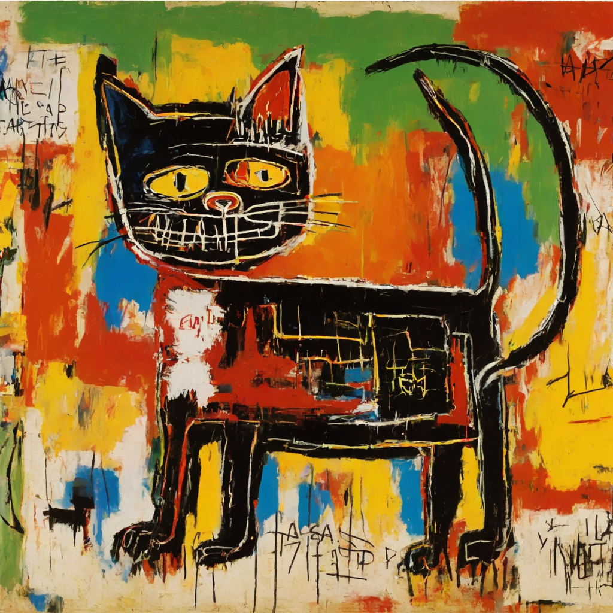
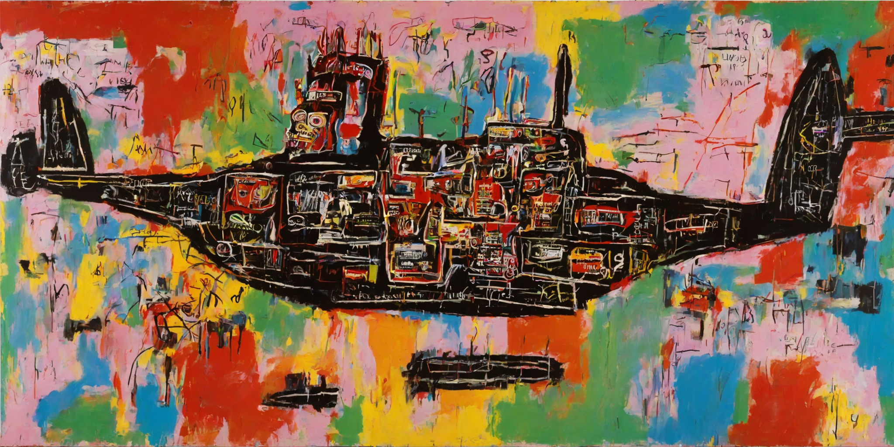
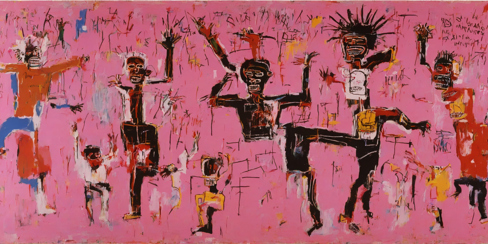

# sdxl-bling

My cog deployment of my stable-diffusion-xl-base-1.0 Lora finetuned on Basquiat paintings 

- API: https://replicate.com/georgedavila/sdxl-bling
- Model: https://huggingface.co/GDavila/sdxl-bling
- Dataset: https://huggingface.co/datasets/GDavila/diamondWatches

Trigger word: TOK

## Lora Outputs

"A TOK painting of a cat, rainbow background"

"A TOK painting of a spaceship, rainbow background"

"A TOK painting of people dancing, pink background"

