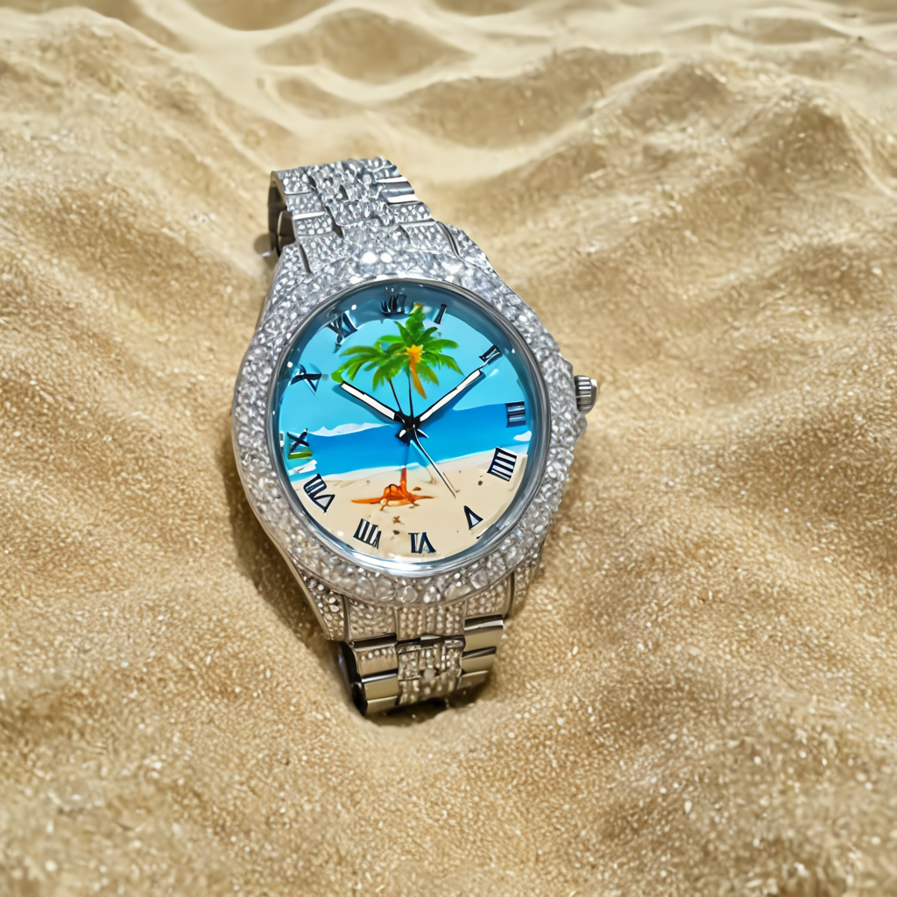
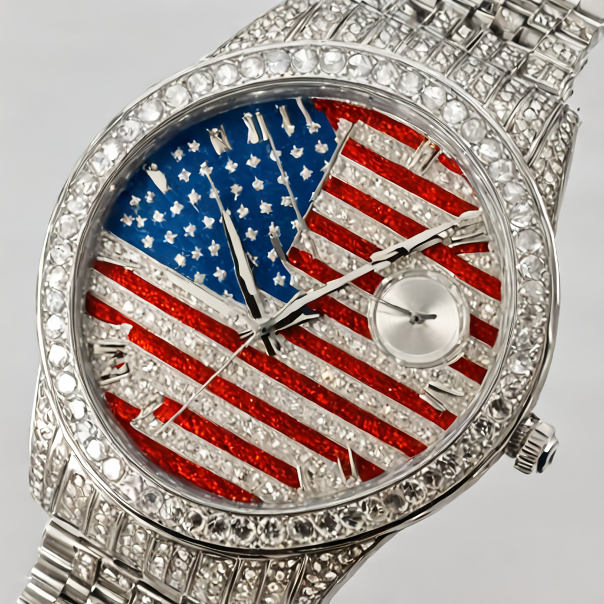
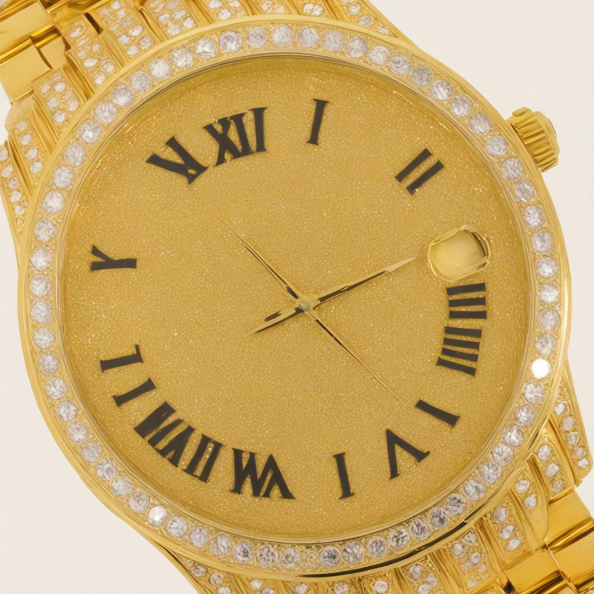

# sdxl-bling

My cog deployment of my stable-diffusion-xl-base-1.0 Lora finetuned on diamond watches

- API: https://replicate.com/georgedavila/sdxl-bling
- Model: https://huggingface.co/GDavila/sdxl-bling
- Dataset: https://huggingface.co/datasets/GDavila/diamondWatches

Trigger word: TOK

## Lora Outputs

"a photo of a beach-themed watch, in the style of TOK"

"a photo of an American flag watch, in the style of TOK"

"a photo of a diamond watch, in the style of TOK"
